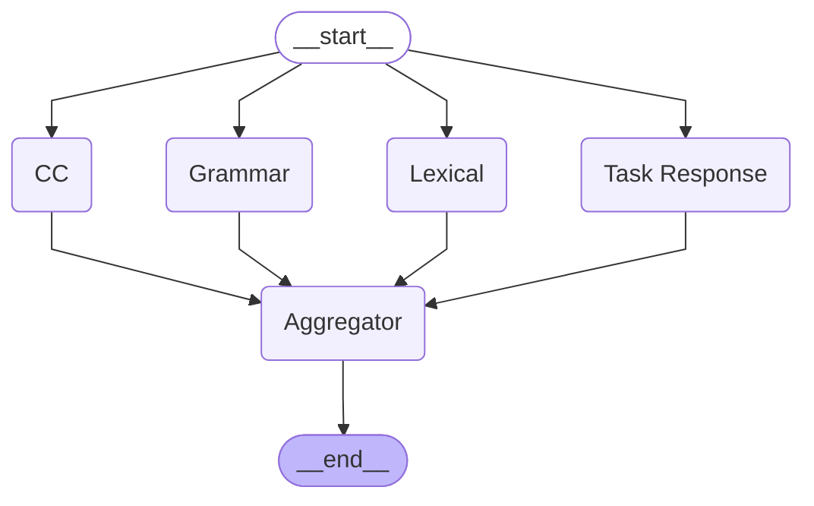

```mermaid
---
config:
  flowchart:
    curve: linear
---
graph TD;
	__start__([<p>__start__</p>]):::first
	Task_Response(Task Response)
	Lexical(Lexical)
	Grammar(Grammar)
	CC(CC)
	Aggregator(Aggregator)
	__end__([<p>__end__</p>]):::last
	CC --> Aggregator;
	Grammar --> Aggregator;
	Lexical --> Aggregator;
	Task_Response --> Aggregator;
	__start__ --> CC;
	__start__ --> Grammar;
	__start__ --> Lexical;
	__start__ --> Task_Response;
	Aggregator --> __end__;
	classDef default fill:#f2f0ff,line-height:1.2
	classDef first fill-opacity:0
	classDef last fill:#bfb6fc

```