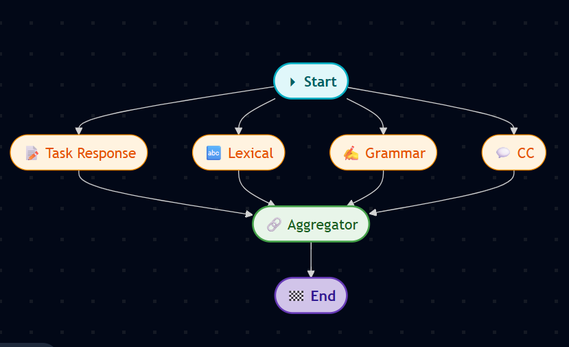

Multi-Agent IELTS Writing Examiner
This project leverages a multi-agent system built with LangGraph and Google's Gemini Pro to provide a detailed, automated evaluation of IELTS Writing tasks. It simulates a panel of expert IELTS examiners, where each agent specializes in one of the four official scoring criteria:

Task Achievement / Task Response

Coherence and Cohesion

Lexical Resource

Grammatical Range and Accuracy

The system provides a comprehensive report, including individual scores for each criterion, specific feedback, and an overall estimated band score, helping users understand their strengths and weaknesses.

Features
Multi-Agent Architecture: Utilizes specialized AI agents for a deep and nuanced evaluation of each scoring criterion.

Comprehensive Feedback: Delivers detailed positive and constructive feedback for each of the four marking criteria.

IELTS Task 1 & 2 Support:

Task 1 (Academic): Analyzes reports based on visual data (graphs, charts, diagrams) by processing an image input.

Task 2: Evaluates essays based on a textual question prompt.

Automated Scoring: Calculates an estimated overall band score based on the official IELTS rounding rules.

Clear & Formatted Output: Presents the final evaluation in a clean, easy-to-read report directly in your terminal.

Workflow
The project uses a graph-based workflow orchestrated by LangGraph. Four specialist agents work in parallel to analyze the student's essay. Their individual reports are then passed to a final aggregator agent, which synthesizes the results and calculates the final score.

Project Structure
.
├── .env
├── main.py                 # Main script to run the evaluation
├── nodes.py                # Contains the logic for each specialist agent (node)
├── state.py                # Defines the shared state object for the graph
├── workflow.py             # Defines the LangGraph workflow structure
├── model.py                # Initializes the Gemini Pro model
├── display_report.py       # Formats and prints the final report
├── task_image.png          # Example image for a Task 1 evaluation
└── requirements.txt        # Python dependencies

Setup and Installation
1. Prerequisites
Python 3.8 or higher

A Google AI Studio API Key

2. Clone the Repository
git clone https://github.com/AmirEbrahiminasab/Multi-Agent-IELTS-Writing-Examiner
cd "Multi-Agent-IELTS-Writing-Examiner"

3. Install Dependencies
Install the required Python packages using pip:

pip install -r requirements.txt

4. Set Up Environment Variables
Create a file named .env in the root directory of the project and add your Google AI Studio API key:

GOOGLE_API_KEY="YOUR_API_KEY_HERE"

The application uses python-dotenv to load this key automatically.

How to Use
The evaluation is run from the main.py script. You need to configure it based on whether you are running a Task 1 or Task 2 evaluation.

For IELTS Writing Task 1 (Image-based)
Place Your Image: Put the image file for the Task 1 prompt (e.g., a chart or graph) in the root directory.

Edit main.py:

Update the image_path variable to match the filename of your image.

Paste the student's essay into the student_essay variable.

# main.py

# ... (imports and functions)

# 1. Update with your image file name
image_path = "task_image.png"
base64_image = encode_image(image_path)
image_url = f"data:image/png;base64,{base64_image}"

initial_state = {
    "image_url": image_url,
    # 2. Paste the student's essay here
    "student_essay": """The graph below compares different proportation of people that were..."""
}

# ... (rest of the script)

Run the script:

python main.py

For IELTS Writing Task 2 (Text-based)
(Note: This requires a slightly modified main.py and state.py to handle a text question instead of an image URL.)

Edit main.py (for Task 2):

Remove the image processing logic.

Add a question variable for the Task 2 prompt.

Update the initial_state to include the question and student_essay.

# main.py (Example for Task 2)

# ... (imports)

# 1. Add the Task 2 question
task_question = "Some people believe that unpaid community service should be a compulsory part of high school programmes. To what extent do you agree or disagree?"

initial_state = {
    "question": task_question,
    # 2. Paste the student's essay here
    "student_essay": """In recent years, the integration of community service into high school curricula has sparked considerable debate..."""
}

# ... (rest of the script)

Run the script:

python main.py

Example Output
After running the script, a detailed report will be printed to your terminal, formatted for readability:

================================================================================
📝 IELTS WRITING EVALUATION REPORT
================================================================================

📌 Original Question:
[The question you provided]

📄 Student's Essay:
[The essay you provided]
--------------------------------------------------------------------------------

✅ Task Response ---

**1. What You Did Well:**
...
**6. Final Task Response Score:** 6

🔗 Coherence and Cohesion ---

**1. What You Did Well:**
...
**6. Final Coherence and Cohesion Score:** 6

... (and so on for Lexical Resource and Grammar) ...

📊 Overall Summary & Final Score ---

**Overall IELTS Writing Task 1 (Academic) Feedback**
...
**Final Analysis and Overall Score**
* Summative Comments: Overall, your report is logically structured...
* Overall Band Score: 6.5
================================================================================

Technologies Used
LangChain & LangGraph: For building and orchestrating the multi-agent workflow.

Google Gemini Pro: The core Large Language Model powering the expert agents.

Python: The programming language used for the entire project.